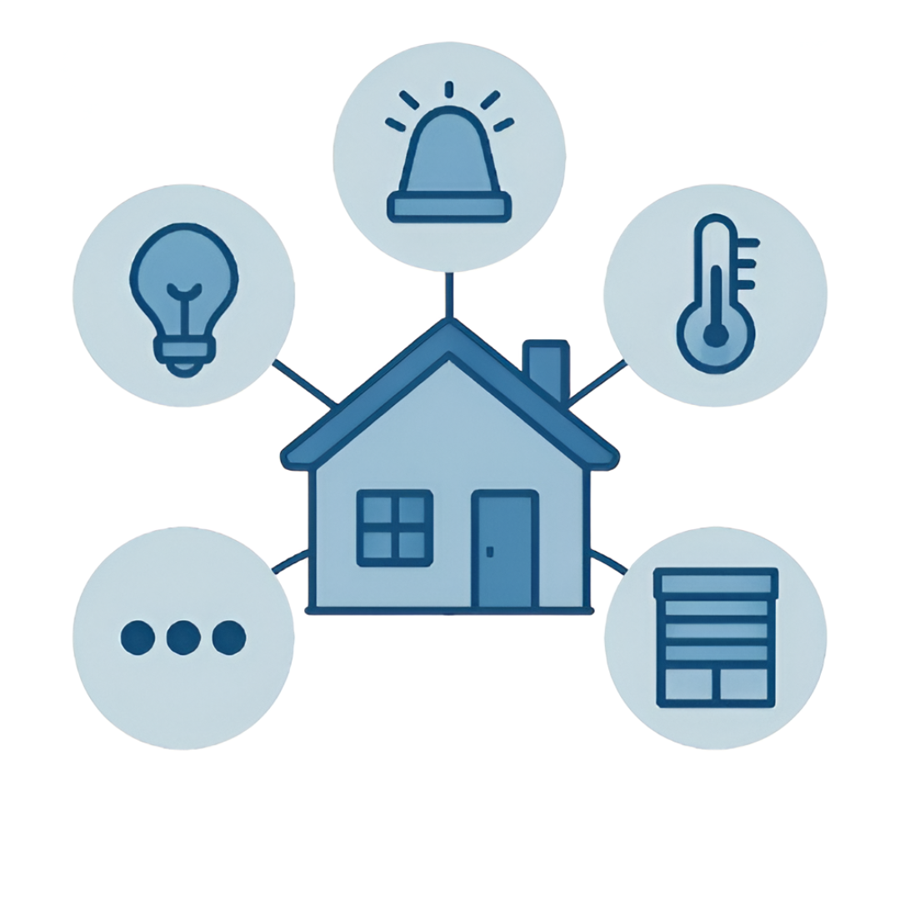
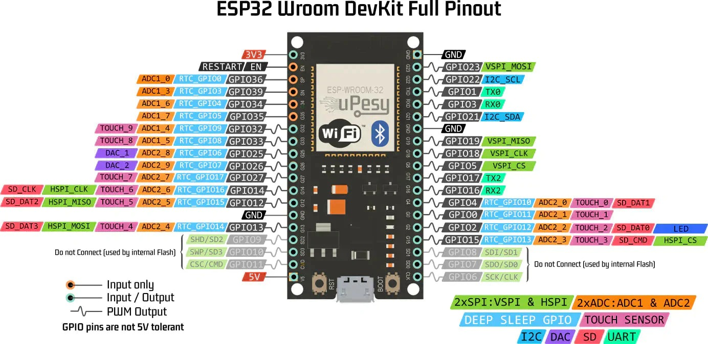

<a id="top"></a>

  </a>

<!-- PROJECT LOGO -->
<br />
<div align="center">
  <a href="https://github.com/PoliDaniel01/Smart_Home_ESP32">
    
  </a>

<h3 align="center">SMART HOME</h3>

  <p align="center">
    Implementation of a Smart Home with ESP32

  </p>
</div>

 </p>
</div>


<details>
<summary>📚 <b>Table of Contents</b></summary>

 1. [About the project](#-smart-home-with-esp32-master---slave)  

 2. [Requirements](#️-requirements)
  
 3. [Project Structure](#️-project-structure)
  
 4. [Project Explanation](#-project-explanation)
  
 5. [How to Start](#-how-to-start)
  
 6.  [ Video and Presentation](#-video-and-presentation)

 7.  [Contacts](#-contacts)
  
</details>


# 🏠 **Smart Home with ESP32 master - slave**

This project implements a **smart home automation system** using a network of ESP32 microcontrollers.
The system follows a **master-slave architecture**:
- **Master ESP32:** Central hub coordinating communication and control logic (e.g., sensors, user inputs).
- **Slave ESP32s:** Nodes handling localized tasks (e.g., room-specific lighting, temperature monitoring).
- **Stack:** Firmware is written in **MicroPython** for rapid development and IoT-focused functionality.  

<p align="right">(<a href="#top">back to top</a>)</p>  

# 🛠️ **Requirements**
## 🐍**Software Requirements**
To get started with this project, you will require the following software.
- MicroPython interpreter
- MQTT library
- Python libraries for device drivers
- Web server software
- JSON handling library

## 🖥️ **Hardware Requirements**
To get started with this project, you will need the following hardware:
- ESP32 microcontroller
- ST7789 display
- BME680 sensor
- Wi-Fi module
- General I/O devices   
<p float="center">
  
</p>


<p align="right">(<a href="#top">back to top</a>)</p>  
 
# 🗂️ **Project Structure**

```
Smart_Home_ESP32/
│
├──Readme_img                                # readme images
│   ├──ESP32.jpeg                                   # ESP32 ping image
│   └──House.png                                    # Readme logo
│   
├──Smart_Home_project/                       # Project root
│   ├──connections/                                 # networking
│   │   ├── client.py                                   # client script
│   │   ├── hub.py                                      # hub script
│   │   ├── index.html                                  # web interface
│   │   └── states.json                                 # data storage
│   │
│   ├──master/                                      # master control
│   │   ├── lib/                                        # library
│   │   │   ├── screen file/                                # screen management
│   │   │   │    └── xpt2046.py                                 # devide driver  
│   │   │   ├── st7789/                                     # display driver
│   │   │   │    └── st7789py.py                                    # device driver
│   │   │   ├── umqtt/                                      # mqtt library
│   │   │   │    ├── robust.py                                  # robust connection
│   │   │   │    └── simple.py                                  # simple connection
│   │   │   └── bitmap                                      # image data
│   │   └── master.py                                   # master script
│   │   
│   ├──micropython_utils/                           # micropython utils
│   │   ├── ESP32_GENERIC-20250415-v1.25.0.bin          # firmware
│   │   └── ESP32_GENERIC_S3-20250415-v1.25.0.bin       # firmware
│   │
│   ├──slaves/                                      # slave devices
│   │   ├── alarm/                                      # allarm control
│   │   │   ├── lib/                                        # library
│   │   │   │    └──umqtt/                                      # mqtt library
│   │   │   │         ├── robust.py                                 # robust connection
│   │   │   │         └── simple.py                                 # simple connection
│   │   │   └── alarm.py                                # light script
│   │   │
│   │   ├── climate/                                    # climate control
│   │   │   ├── lib/                                        # library
│   │   │   │    ├── bme680/                                    # sensor library
│   │   │   │    │    ├── __init__.py                               # initialization 
│   │   │   │    │    ├── bme680.py                                 # sensor script
│   │   │   │    │    └── constants.py                              # config
│   │   │   │    └──umqtt/                                  # mqtt library
│   │   │   │         ├── robust.py                             # robust connection
│   │   │   │         └── simple.py                             # simple connection
│   │   │   └── climate.py                              # climate script
│   │   │ 
│   │   ├── lights/                                     # light control
│   │   │   ├── lib/                                        # library
│   │   │   │    └──umqtt/                                      # mqtt library
│   │   │   │         ├── robust.py                                 # robust connection
│   │   │   │         └── simple.py                                 # simple connection
│   │   │   └── lights.py                               # light script
│   │   │
│   │   └──shutters/                                    #s hutter control
│   │       ├── lib/                                        # library
│   │       │    └──umqtt/                                      # mqtt library
│   │       │         ├── robust.py                                 # robust connection
│   │       │         └── simple.py                                 # simple connection
│   │       └── shutters.py                                 # shutter scripot
│   │
│   └──utils/                                       # utility script
│       ├── mqtt_retry.py                               # MQTT retry script
│       └── wifi_config_tool.py                         # WiFi configuration tool
│   
└── README.md                                   # Documentation 
```
<p align="right">(<a href="#top">back to top</a>)</p>


# 🔍 **Project Explanation**
This project is a home automation system built using MicroPython and ESP32 microcontrollers.  
It controls various devices such as lights, shutters, climate and alarm settings through a network using MQTT communication.  
The system includes a web interface for monitoring and control, with data stored in states.json.  
Device drivers (e.g., st7789 for displays, bme680 for sensors) and utility scripts (e.g., wifi_config_tool.py) support the functionality, making it a flexible and scalable solution for domotic application.  
<p align="right">(<a href="#top">back to top</a>)</p>


# 🚀 **How to Start**
1. Ensure you have the required software and hardware as listed in the Requirements section.
2. Flash the ESP32 with the appropriate firmware (e.g., ESP32_GENERIC_28259415-v1.25.0.bin).
3. Set up the hardware:
    - Connect the ST7789 display and BME680 sensor to the ESP32.
    - Configure Wi-Fi settings using wifi_config_tool.py.
    - Wire the lights, shutters, climate control and alarm devices to the ESP32 I/O pins.
4. Upload the project files to the ESP32 and run master.py to start the system.
5. Access the web interface via index.html to begin controlling and monitoring your devices.  
<p align="right">(<a href="#top">back to top</a>)</p>


# 📹 **Video and Presentation**
  - Presentation [slides](https://docs.google.com/presentation/d/1vCAURBxBGKJeMjcmVpE1Y5AZ5l1dgMD1rOJj8b4t1aw/edit?usp=sharing)
<p align="right">(<a href="#top">back to top</a>)</p>


# 🌐 **Contacts**
Alessandro Morelato - alessandro.morelato@studenti.unitn.it - @morelatoalessandro  
Daniel Poli - daniel.poli@studenti.unitn.it - @PoliDaniel01  
Matteo Scoropan - matteo.scoropan@studenti.unitn.it - @Matteosco  
Sebastiano Quaglio - sebastiano.quaglio@studenti.unitn.it - @quaglio03  

<p align="right">(<a href="#top">back to top</a>)</p>