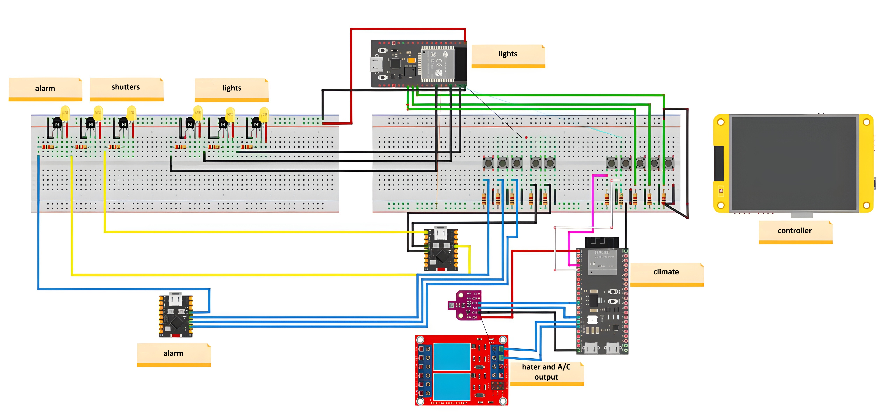

<a id="top"></a>

  </a>

<!-- PROJECT LOGO -->
<br />
<div align="center">
  <a href="https://github.com/PoliDaniel01/Smart_Home_ESP32">
    
  </a>

<h3 align="center">SMART HOME</h3>

  <p align="center">
    Implementation of a Smart Home with ESP32

  </p>
</div>

 </p>
</div>


<details>
<summary>📚 <b>Table of Contents</b></summary>

 1. [About the project](#-smart-home-with-esp32-master---slave)  

 2. [Requirements](#️-requirements)
  
 3. [Project Structure](#️-project-structure)
  
 4. [Project Explanation](#-project-explanation)
  
 5. [How to Start](#-how-to-start)
  
 6.  [ Video and Presentation](#-video-and-presentation)

 7.  [Contacts](#-contacts)
  
</details>


# 🏠 **Smart Home with ESP32 master - slave**

This project implements a **smart home automation system** using a network of ESP32 microcontrollers.
The system follows a **master-slave architecture**:
- **Master ESP32:** Central hub coordinating communication and control logic (e.g., sensors, user inputs).
- **Slave ESP32s:** Nodes handling localized tasks (e.g., room-specific lighting, temperature monitoring).
- **Stack:** Firmware is written in **MicroPython** for rapid development and IoT-focused functionality.  

<p align="right">(<a href="#top">back to top</a>)</p>  

# 🛠️ **Requirements**
## 🐍**Software Requirements**
To get started with this project, you will require the following software.
- MicroPython interpreter
- MQTT library
- Python libraries for device drivers
- Web server software
- JSON handling library

## 🖥️ **Hardware Requirements**
To get started with this project, you will need the following hardware:
- ESP32 microcontroller
- ST7789 display
- BME680 sensor
- Wi-Fi module
- General I/O devices   
<p float="center">
  
</p>


<p align="right">(<a href="#top">back to top</a>)</p>  
 
# 🗂️ **Project Structure**
```
Smart_Home_ESP32/  
│  
├── Readme_img/                                   # Readme images  
│   ├── ESP32.jpeg                                  # Image of ESP32 board  
│   ├── House.png                                   # Readme logo image   
│   └── wiring_diagram.jpg                          # Wiring diagram
│     
├── Smart_Home_project/                           # Main project directory  
│   ├── __pycache__/                                # Compiled Python cache  
│   │   └── __init__.cpython-312.pyc                  # Compiled init file  
│   │  
│   ├── common/                                     # Shared utilities  
│   │   ├── lib/                                      # Common libraries  
│   │   │   ├── __init__.cpython-312.pyc                # Compiled init file  
│   │   │   ├── display.cpython-312.pyc                 # Compiled display module  
│   │   │   ├── html_templates.cpython-312.pyc          # Compiled HTML templates  
│   │   │   ├── mqtt.cpython-312.pyc                    # Compiled MQTT module  
│   │   │   ├── webserver.cpython-312.pyc               # Compiled webserver module  
│   │   │   └── wifi.cpython-312.pyc                    # Compiled WiFi module  
│   │   ├── __init__.py                               # Package initializer  
│   │   ├── display.py                                # Display control functions  
│   │   ├── html_templates.py                         # HTML templates for webserver  
│   │   ├── mqtt.py                                   # MQTT communication functions  
│   │   ├── webserver.py                              # Webserver for ESP32  
│   │   └── wifi.py                                   # WiFi connection management  
│   │  
│   ├── master/                                       # Master control scripts  
│   │   ├── __pycache__/                                # Compiled Python cache  
│   │   │   ├── __init__.cpython-312.pyc                  # Compiled init file  
│   │   │   └── main.cpython-312.pyc                      # Compiled main script  
│   │   ├── __init__.py                                 # Package initializer  
│   │   └── main.py                                     # Main master control script  
│   │     
│   ├── micropython_utils/                            # MicroPython utilities  
│   │   ├── ESP32_GENERIC-20250415-v1.25.0.bin          # ESP32 firmware  
│   │   └── ESP32_GENERIC_S3-20250415-v1.25.0.bin       # ESP32-S3 firmware  
│   │  
│   ├── slaves/                                       # Slave device scripts  
│   │   ├── alarm/                                      # Alarm control  
│   │   │   ├── __pycache__/                              # Compiled Python cache  
│   │   │   │    ├── __init__.cpython-312.pyc               # Compiled init file  
│   │   │   │    └── main.cpython-312.pyc                   # Compiled alarm script  
│   │   │   ├── __init__.py                               # Package initializer  
│   │   │   └── main.py                                   # Alarm control script  
│   │   │  
│   │   ├── climate/                                  # Climate control  
│   │   │   ├── __pycache__/                            # Compiled Python cache  
│   │   │   │    ├── __init__.cpython-312.pyc             # Compiled init file  
│   │   │   │    └── main.cpython-312.pyc                 # Compiled climate script  
│   │   │   ├── __init__.py                             # Package initializer  
│   │   │   └── main.py                                 # Climate control script  
│   │   │   
│   │   ├── lights/                                   # Light control  
│   │   │   ├── __pycache__/                            # Compiled Python cache  
│   │   │   │    ├── __init__.cpython-312.pyc             # Compiled init file  
│   │   │   │    └── main.cpython-312.pyc                 # Compiled lights script  
│   │   │   ├── __init__.py                             # Package initializer  
│   │   │   └── main.py                                 # Light control script  
│   │   │  
│   │   └── shutters/                                 # Shutter control  
│   │       ├── __pycache__/                            # Compiled Python cache  
│   │       │    ├── __init__.cpython-312.pyc             # Compiled init file  
│   │       │    └── main.cpython-312.pyc                 # Compiled shutters script  
│   │       ├── __init__.py                             # Package initializer  
│   │       └── main.py                                 # Shutter control script  
│   │  
│   ├── utils/                                      # Utility scripts  
│   │   ├── mqtt_retry.py                             # MQTT reconnection logic  
│   │   └── wifi_config_tool.py                       # WiFi configuration utility  
│   │  
│   └── __init__.py                                 # Project package initializer  
│     
├── docs/                                           # Documentation files  
│   ├── _modules/                                     # Module documentation  
│   │   ├── smarthome/                                  # Smart home module docs  
│   │   └── index.html                                  # Documentation index  
│   │  
│   ├── _sources/                                     # Documentation source files  
│   │   ├── index.rst.txt                               # Main documentation source  
│   │   └── modules.rst.txt                             # Modules documentation source  
│   │  
│   ├── _static/                                      # Static documentation assets  
│   ├── .buildinfo                                    # Documentation build info  
│   ├── genindex.html                                 # General index page  
│   ├── index.html                                    # Main documentation page  
│   ├── modules.html                                  # Modules documentation page  
│   ├── objects.inv                                   # Documentation objects inventory  
│   ├── py-modindex.html                              # Python module index  
│   ├── search.html                                   # Search page for docs  
│   └── searchindex.js                                # Search index script  
│  
├── lib/                                            # External libraries  
│   ├── bme680/                                       # BME680 sensor library  
│   │   ├── __init__.py                                 # Package initializer  
│   │   ├── bme680.py                                   # BME680 sensor functions  
│   │   └── constants.py                                # BME680 sensor constants  
│   ├── umqtt/                                        # MQTT library  
│   │   ├── __init__.py.py                              # Package initializer  
│   │   └── simple.py                                   # Simple MQTT client  
│   │  
│   ├── bitmap                                        # Bitmap handling library  
│   ├── microdot_asyncio.py                           # Microdot web framework  
│   ├── st7889py.py                                   # ST7789 display driver  
│   └── xpt2046.py                                    # XPT2046 touch controller  
│  
├── README.md                                       # Project documentation  
│  
└── boot.py                                         # MicroPython boot script  
```
<p align="right">(<a href="#top">back to top</a>)</p>


# 🔍 **Project Explanation**
This project is a home automation system built using MicroPython and ESP32 microcontrollers.  
It controls various devices such as lights, shutters, climate and alarm settings through a network using MQTT communication.  
The system includes a web interface for monitoring and control, with data stored in states.json.  
Device drivers (e.g., st7789 for displays, bme680 for sensors) and utility scripts (e.g., wifi_config_tool.py) support the functionality, making it a flexible and scalable solution for domotic application.  
<p align="right">(<a href="#top">back to top</a>)</p>


# 🚀 **How to Start**
1. Ensure you have the required software and hardware as listed in the Requirements section.
2. Flash the ESP32 with the appropriate firmware (e.g., ESP32_GENERIC_28259415-v1.25.0.bin).
3. Set up the hardware:
    - Connect the ST7789 display and BME680 sensor to the ESP32.
    - Configure Wi-Fi settings using wifi_config_tool.py.
    - Wire the lights, shutters, climate control and alarm devices to the ESP32 I/O pins.
4. Upload the project files to the ESP32 and run master.py to start the system.
5. Access the web interface via index.html to begin controlling and monitoring your devices. 
## 🔌 **Wiring Diagram**
<p float="center">
  
</p>
<p align="right">(<a href="#top">back to top</a>)</p>


# 📹 **Video and Presentation**
  - Presentation [slides](https://docs.google.com/presentation/d/1vCAURBxBGKJeMjcmVpE1Y5AZ5l1dgMD1rOJj8b4t1aw/edit?usp=sharing)  
  - Smart Home video [video](https://drive.google.com/file/d/1ewrgMpUsM_jIc1RVoieHL5TeZM0HrdUM/view?usp=sharing)
<p align="right">(<a href="#top">back to top</a>)</p>


# 🌐 **Contacts**
Alessandro Morelato - alessandro.morelato@studenti.unitn.it - @morelatoalessandro  
Daniel Poli - daniel.poli@studenti.unitn.it - @PoliDaniel01  
Matteo Scoropan - matteo.scoropan@studenti.unitn.it - @Matteosco  
Sebastiano Quaglio - sebastiano.quaglio@studenti.unitn.it - @quaglio03  

<p align="right">(<a href="#top">back to top</a>)</p>